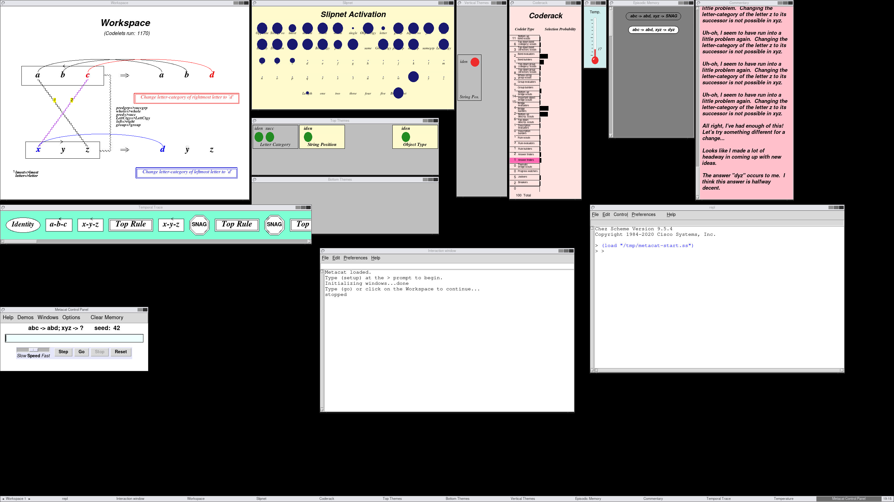

# Metacat: Try a Classic Analogy-Making AI

[James B. Marshall's Metacat](https://science.slc.edu/jmarshall/metacat/)
explores questions such as: "If `abc` changes to `abd`, what should `xyz`
change to?" Its graphical interface lets you watch it build interpretations
and remember previous answers. This is a classic AI/cognitive-modeling project,
not a modern language model. You do not need a GPU, an API key, or a training
dataset to try it.

This bundle reconstructs Metacat 1.2 with bug fixes and an optional
display-free ("headless") mode. **Start with the browser-based graphical
interface below.** Docker runs the older software on your computer, and your
normal web browser displays its desktop. You do not need to learn Scheme or
install the old graphics libraries yourself.

Only patches, documentation, checksums, and reconstruction/test tools are
included here, **not the original source or its archive**. A helper downloads
the [original Metacat-1.2.tgz](https://science.slc.edu/jmarshall/metacat/Metacat-1.2.tgz)
from the author and applies the changes. This folder works independently of
the rest of Petacat; do not install Petacat's other application dependencies.

## Start Here

1. [Install the prerequisites](#1-install-the-prerequisites) for your computer.
2. [Download this bundle](#2-download-this-bundle).
3. [Reconstruct Metacat](#3-reconstruct-metacat).
4. [Start the graphical interface](#4-start-the-graphical-interface).
5. [Try your first analogy](#5-try-your-first-analogy).
6. [Stop and return later](#6-stop-and-return-later).

There are also sections on [troubleshooting](#troubleshooting),
[headless tests](#optional-headless-tests),
[automatically installed dependencies](#what-docker-installs-for-you), and
[the patches](#what-the-patches-change).

Allow time for software downloads and the first Docker build, which can take
several minutes or longer under CPU emulation. Allow several GB of free disk
space for Docker and its build cache; this is a planning allowance, not a
measured minimum. Check Docker's linked installation page for current operating
system, memory, and virtualization requirements. Internet access is needed for
installation, reconstruction, and the first build. The built application runs
locally without a cloud service.

The container GUI has been validated, with a known intermittent startup issue.
The host-installation instructions below have not all been exercised on fresh
Mac, Windows, and Linux installations. See [VALIDATION.md](VALIDATION.md) for
what was actually tested.

Three reproducible reference-engine failures were subsequently found during
the versioned support study. They are **not fixed by these patches**. See
[KNOWN-FAILURES.md](KNOWN-FAILURES.md) for the exact inputs and seeds,
recorded exceptions, investigation starting points, and a small standalone
reproducer. The [full study data](../studies/support-v1a/data/README.md) is
published separately from this source-reconstruction bundle.

## 1. Install the Prerequisites

These are the tools needed **on your computer**. Follow only your operating
system's section below; it explains how to obtain them.

| Software | What it does | Installation |
| --- | --- | --- |
| A web browser | Displays and controls Metacat | Your existing up-to-date browser; [Firefox](https://www.firefox.com/) is one option. No browser extension or separate VNC viewer is needed. |
| [Docker Desktop](https://docs.docker.com/desktop/) with [Docker Compose](https://docs.docker.com/compose/install/) | Builds and runs the old runtime in an isolated Linux environment | Install Docker Desktop for your OS below; Compose is included. Open the Docker Desktop application after installing it. |
| [Python 3](https://www.python.org/downloads/) | Runs the reconstruction helper and packaging tests | Python 3.9 or newer is required; prefer a currently supported stable release. No `pip` packages or virtual environment are needed. |
| [curl](https://curl.se/) | Downloads the original archive | Normally included on macOS; installed by the Linux/WSL command below. |
| [patch](https://www.gnu.org/software/patch/) | Applies the recorded source changes | The macOS system version works; installed by the Linux/WSL command below. |
| [Git](https://git-scm.com/downloads) | Downloads a copy of this repository | Apple Command Line Tools on Mac; installed by the Linux/WSL command below. Optional if you use GitHub's Download ZIP instead. |

You will use a **terminal**, a window where you paste commands and press Return
(Enter). Run commands one line at a time and wait for each to finish. Do not
type the code block's surrounding backticks. `cd` changes the folder in which
commands run; `~` means your home folder. When `sudo` asks for your password,
typing may display no characters at all. That is normal.

### Mac

1. Open **Terminal** from Applications > Utilities, or search for Terminal
   using Spotlight.
2. Install Apple's command-line tools, which provide Git. Paste this command,
   press Return, and complete the installer dialog. If it says the tools are
   already installed, continue. The full Xcode application is not required.
   See [Apple's installation guide](https://developer.apple.com/documentation/xcode/installing-the-command-line-tools)
   and [Git's Mac instructions](https://git-scm.com/install/mac).

   ```sh
   xcode-select --install
   ```

3. Run `python3 --version`. If it is missing or older than 3.9, download a
   stable **macOS 64-bit universal2 installer** from
   [Python for macOS](https://www.python.org/downloads/macos/), open the `.pkg`,
   and follow the installer. Complete the `Install Certificates.command` step
   described in [Python's Mac guide](https://docs.python.org/3/using/mac.html).
   Close and reopen Terminal after installation.
4. Follow [Install Docker Desktop on Mac](https://docs.docker.com/desktop/setup/install/mac-install/).
   Choose **Apple silicon** for an M-series Mac, or **Intel chip** for an Intel
   Mac. Apple menu > About This Mac shows which you have. Open the `.dmg`, drag
   Docker to Applications, then launch Docker from Applications and finish its
   setup. Keep it running while using Metacat.

Metacat's container deliberately uses `linux/amd64`, even on Apple silicon,
because its old Scheme/SWL combination needs that architecture. Do not change
the Compose platform to `arm64`. Docker Desktop supplies emulation; see
[Docker's multi-platform documentation](https://docs.docker.com/build/building/multi-platform/).
For Apple silicon, Docker's Mac installation guide also explains the optional
Rosetta installation. Performance depends on the selected virtualization and
emulation settings.

`curl` and `patch` are normally already available on macOS. Check them in the
verification step below; a fallback is in [troubleshooting](#troubleshooting).

### Windows: Use Ubuntu Through WSL 2

Use this route on a supported Intel/AMD 64-bit Windows computer. Windows on Arm
is not covered by this walkthrough. WSL 2 gives Windows a Linux environment;
the reconstruction commands below are **not PowerShell commands**.

1. Follow [Microsoft's WSL installation guide](https://learn.microsoft.com/en-us/windows/wsl/install).
   Open PowerShell using **Run as administrator**, run this command, and restart
   Windows if prompted:

   ```powershell
   wsl --install -d Ubuntu
   ```

2. Open **Ubuntu** from the Start menu. Finish its first-run setup by creating
   a Linux username and password. In PowerShell, `wsl --list --verbose` should
   show Ubuntu with version `2`. If it shows `1`, use
   `wsl --set-version Ubuntu 2` before continuing.
3. Install [Docker Desktop for Windows](https://docs.docker.com/desktop/setup/install/windows-install/),
   choosing its **WSL 2** backend. Launch Docker Desktop. Under Settings >
   Resources > WSL Integration, enable **Ubuntu** and apply the change. Follow
   [Docker's WSL integration guide](https://docs.docker.com/desktop/features/wsl/)
   if that setting is missing. Use **Linux containers**, not Windows containers.
   Do not install a second Docker Engine inside Ubuntu for this route.
4. In the **Ubuntu terminal**, install the download/reconstruction tools:

   ```sh
   sudo apt update
   sudo apt install -y python3 curl patch git ca-certificates
   ```

Use that Ubuntu terminal for **all remaining shell commands in this README**.
Keep the project in Ubuntu's home folder, as the download step does, rather
than under `/mnt/c`. Open the eventual GUI URL in your ordinary Windows browser.

### Linux: Ubuntu or Debian

1. Open your distribution's Terminal application. Install the host tools:

   ```sh
   sudo apt update
   sudo apt install -y python3 curl patch git ca-certificates
   ```

   These commands use Ubuntu/Debian's package manager; see
   [Ubuntu's package-management guide](https://ubuntu.com/server/docs/package-management).
2. Follow [Docker Desktop for Linux](https://docs.docker.com/desktop/setup/install/linux/)
   and select your distribution. On supported Ubuntu, use
   [Docker's Ubuntu instructions](https://docs.docker.com/desktop/setup/install/linux/ubuntu/):
   set up the Docker package repository as directed, download the `.deb`
   installer, and install that downloaded file with `sudo apt install` using
   the filename in the guide. Then launch **Docker Desktop** from your
   application menu and finish its setup.
3. Keep Docker Desktop running and continue with the checks below.

This beginner Linux route assumes an x86-64 computer and a supported desktop
distribution. For another distribution, use its package manager and Docker's
matching installation guide, not the `apt` commands above.

If you already use Docker Engine instead of Docker Desktop, you may keep it:
you need a working Docker daemon and the **Compose plugin**. Installation guides
are [Docker Engine on Ubuntu](https://docs.docker.com/engine/install/ubuntu/) and
[the Compose plugin](https://docs.docker.com/compose/install/linux/). You do not
need both Engine and Desktop. ARM Linux hosts additionally need working
`linux/amd64` emulation and are outside this beginner walkthrough.

### Check That the Tools Are Ready

In Terminal on Mac/Linux, or **Ubuntu** on Windows, run:

```sh
python3 --version
curl --version
patch --version
git --version
docker compose version
docker info
```

The first five commands should print version information. Python must be at
least 3.9. Skip the Git check if using Download ZIP. `docker info` must show a
**Server** section without a connection or permission error; having only the
Docker command installed is not enough. Resolve errors before continuing.

## 2. Download This Bundle

If you already have the repository, open a terminal in its `Metacat` folder
and skip the download. Otherwise run:

```sh
mkdir -p ~/metacat-project
cd ~/metacat-project
git clone https://github.com/MishkinBerteig/Petacat.git
cd Petacat/Metacat
```

If Git reports that `Petacat` already exists, do not delete it: use your
existing copy or choose a different download folder.

Alternatively, visit [Petacat on GitHub](https://github.com/MishkinBerteig/Petacat),
choose **Code > Download ZIP**, and extract the ZIP before opening its
`Metacat` folder. See [GitHub's download instructions](https://docs.github.com/en/repositories/working-with-files/using-files/downloading-source-code-archives).
On Mac/Linux, type `cd ` in Terminal, drag the extracted `Metacat` folder into
the window, and press Return; if drag-and-drop is unavailable, enter its path
inside double quotes. On Windows, prefer the Git/Ubuntu steps above so files
and permissions stay in the Linux filesystem.

Check your location:

```sh
pwd
ls
```

You should see `README.md`, `manifest.json`, `patches`, `tests`, and `tools`.
**Stay in this folder for the remaining commands**, unless a section explicitly
says otherwise. You do not need to start the main Petacat application.

## 3. Reconstruct Metacat

Run:

```sh
python3 tools/reconstruct.py --output build/source
python3 tools/reconstruct.py --verify build/source
```

The first command downloads the author's original archive, checks that it is
the expected version, applies our two patches, and writes the result into
`build/source`. Both commands should finish with:

```text
Verified 69 files: build/source
```

You now have the complete runnable source on your computer. The original
download was temporary and is removed automatically. The generated `build/`
folder is ignored by Git and **must not be committed** to this patch-only bundle.

This is a one-time step for a given copy. The helper deliberately refuses to
overwrite an existing `build/source`; if you already reconstructed it, use
the verification command and continue. Do not manually unpack the original
archive into this repository or apply the patches yourself.

## 4. Start the Graphical Interface

Make sure Docker Desktop is running. From the same `Metacat` folder, run:

```sh
docker compose -f build/source/docker-compose.yml up --build -d
docker compose -f build/source/docker-compose.yml logs -f metacat
```

The first command builds a Docker **image** (the reusable runtime) and starts
a **container** (the running application). On the first build you will see
downloads and compiler output. Wait for the command to finish; later starts
reuse the built image. The second command follows the application's startup
messages. Wait for:

```text
window layout applied
```

Then press **Ctrl-C** to leave the log display. This only stops following the
logs; it does not stop Metacat. Open this address in your browser:

[Open the Metacat desktop](http://localhost:6080/vnc.html?autoconnect=1&resize=scale)

`localhost` means your own computer. The page should contain the Control Panel,
Workspace, Slipnet, and several other windows. A successful browser connection
by itself is not enough: if you see only a Scheme text console or a blank
desktop, consult [troubleshooting](#troubleshooting).

The browser bridge is called noVNC. It sends your mouse and keyboard input to
the application running locally. This old desktop is large; maximize the
browser window. If its text is too small, open noVNC's side toolbar, then
Settings > Scaling mode, and switch between **Local Scaling** (fit the desktop)
and **None** (full-size text with scrolling).

**Keep it local:** the supplied configuration binds ports 6080 and 5901 to
`127.0.0.1` only. The VNC service has no password. Do not change those bindings
to `0.0.0.0`, forward the ports through your router, or publish this desktop on
the internet. No separate VNC client, X server, or XQuartz installation is needed.

## 5. Try Your First Analogy

1. Find the **Control Panel** inside the browser desktop. Click its problem
   input field, remove any existing text, and type:

   ```text
   abc abd xyz 42
   ```

2. Press **Return/Enter** once to initialize the problem. The three strings
   mean "`abc` changes to `abd`; apply an analogous change to `xyz`." The number
   `42` is a random seed, not a fourth string or a number of iterations.
3. Click **Go**. Watch structures appear in the Workspace and activity change
   in the other windows. An answer should eventually appear in the Workspace
   and Episodic Memory. Our validated fresh-memory run produced `dyz`; that is
   an observed answer, not a uniquely correct answer to the analogy.



Useful controls:

| Control | Effect |
| --- | --- |
| **Go** | Starts or resumes computation. Continuing after an answer can explore further answers. |
| **Stop** | Pauses computation without quitting the application. |
| **Step** | Advances by a small unit of computation, useful for watching changes. |
| **Speed** slider | Adjusts the graphics speed. |
| **Reset** | Restarts the current problem with the same seed, but **retains remembered answers**. |
| **Clear Memory** | Click **Yes** in its confirmation dialog to erase remembered answers. Do this before reinitializing a problem when you want a fresh-memory comparison. |
| **Demos** menu | Selects a prepared problem. Clear memory first, choose a demo, then click Go. |

For another experiment, clear memory and enter `abc abd xyz 43`. Random seed
and remembered answers both affect what happens; a different answer does not
by itself indicate an installation failure. To repeat the first example from
scratch, stop, clear memory, re-enter `abc abd xyz 42`, press Return, and click Go.

Keep the Control Panel, Scheme REPL, and Interaction windows open. Use the
Control Panel's **Windows** menu to hide other windows if the desktop feels
crowded. For the model's background and a detailed interface tour, see the
[author's Metacat guide](https://science.slc.edu/jmarshall/metacat/).

## 6. Stop and Return Later

Closing the browser tab does **not** stop the application. From the same
`Metacat` folder, stop and remove its running container with:

```sh
docker compose -f build/source/docker-compose.yml down
```

This leaves the downloaded project, reconstructed source, and built Docker
image available for next time. Unsaved in-memory state, including episodic
memory, does not survive shutdown. Files explicitly saved into the mounted
source folder remain in `build/source`.

Next time, open Docker Desktop, open Terminal (Ubuntu on Windows), return to
the bundle folder, and start again without rebuilding:

```sh
cd ~/metacat-project/Petacat/Metacat
docker compose -f build/source/docker-compose.yml up -d
docker compose -f build/source/docker-compose.yml logs -f metacat
```

Use your actual folder path if you downloaded elsewhere. Wait for the new
startup's `window layout applied` message, press Ctrl-C, and reopen
[the GUI](http://localhost:6080/vnc.html?autoconnect=1&resize=scale).

## Troubleshooting

Run diagnostic commands from the folder containing **this README**, not the
generated `build/source/README.md`.

| Symptom | What to check |
| --- | --- |
| `python3`, `git`, `curl`, or `patch`: command not found | Complete your OS's prerequisite steps and reopen the terminal. On Windows, use Ubuntu, not PowerShell. See the Mac fallback below if necessary. |
| `can't open file ... tools/reconstruct.py` or Compose file not found | You are in the wrong folder. Run `pwd` and `ls`; return to `Petacat/Metacat`, where `tools` and `patches` are visible. |
| `docker`: command not found, or `compose` is not a Docker command | Install Docker Desktop and reopen the terminal. On Windows, enable Ubuntu's WSL integration. Engine-only Linux installations need the Compose plugin. Use `docker compose`, with a space. |
| Cannot connect to the Docker daemon | Open Docker Desktop and wait for its engine to start, then retry `docker info`. On an Engine-only installation, check its service and permissions using Docker's installation guide. |
| A virtualization or unsupported-platform error | Check Docker's OS requirements. On Windows, verify WSL version 2 and enable hardware virtualization as directed by Microsoft's guide. ARM systems need `linux/amd64` emulation; do not change the project to `arm64`. |
| Download/build fails with a connection or certificate error | Check internet connectivity and any required proxy settings. Retry after fixing the connection. Do not disable certificate checks or bypass the archive checksum. The archive needs to come from the linked upstream site. |
| `Refusing to replace existing destination` | Reconstruction already created that folder. Verify it and continue, or choose a different `--output` path for a separate reconstruction. Do not delete work just to rerun setup. |
| SHA-256 or file-inventory mismatch | Stop and inspect the reported file. The verifier expects untouched reconstructed files, with no extra reports, saved commentary, or bytecode. Keep your working copy; reconstruct into a new directory to compare. Do not edit the manifest just to make a mismatch pass. |
| Port 6080/5901 is already allocated, or container name `metacat` is in use | Inspect `docker ps -a` or Docker Desktop's Containers view. Stop a conflicting container only if you recognize it and no longer need it. Do not remove someone else's container or service. This default setup runs one GUI at a time. |
| Docker reports a denied bind mount or file-sharing error | Keep the project in a normal local folder. On Mac/Linux Docker Desktop, check Settings > Resources > File sharing if available. On Windows, clone inside Ubuntu's home folder rather than `/mnt/c`. |
| The browser cannot connect | Run the status and log commands below. Check that Metacat is running and use the exact `http://localhost:6080/...` link, not HTTPS. |
| Browser connects, but only the Scheme console or a blank desktop appears | Metacat may not have finished loading or may have failed during startup. Look for the readiness message and inspect the Scheme console; use the restart procedure below. |
| Repeating the same seed gives a different result | Reset does not clear episodic memory. Stop, Clear Memory, re-enter the problem and seed, press Return, then Go. |

To inspect the running service without following logs indefinitely:

```sh
docker compose -f build/source/docker-compose.yml ps -a
docker compose -f build/source/docker-compose.yml logs --tail=100 metacat
```

**Known startup issue:** validation observed a `get-bytevector-n!` / `bad address`
file-read error in the Scheme console on an initial start. A full restart
recovered without source changes:

```sh
docker compose -f build/source/docker-compose.yml restart metacat
docker compose -f build/source/docker-compose.yml logs --since=1m -f metacat
```

Wait for a **new** `window layout applied` message, then refresh the browser.
Restarting loses the current in-memory session. The cause of this intermittent
failure is not established; repeated failures need investigation rather than
being treated as successful startup. See [VALIDATION.md](VALIDATION.md).

**Mac fallback for missing curl/patch:** these normally ship with macOS. If they
are genuinely absent, install [Homebrew](https://brew.sh/) using its official
instructions, including its terminal setup step. Then run:

```sh
brew install curl gpatch
export PATH="$(brew --prefix curl)/bin:$(brew --prefix gpatch)/libexec/gnubin:$PATH"
curl --version
patch --version
```

[Homebrew's GNU patch package](https://formulae.brew.sh/formula/gpatch) uses the
`gnubin` directory to make the command available as `patch`;
[Homebrew's curl package](https://formulae.brew.sh/formula/curl) similarly needs
its own `bin` directory on the search path. The `export` above applies to the
current terminal session; run the remaining reconstruction steps there.
Homebrew is optional, not a prerequisite for the normal Mac route.

When asking for help, share the failing command, error text, OS/CPU type, and
relevant version information. Review logs and screenshots first and remove
personal paths, credentials, or unrelated environment information.

## What Docker Installs for You

**No separate manual installation is needed for any item in this table.**
The `docker compose ... up --build -d` command builds and installs these inside
the container. They are not added to your computer's normal application setup.

| Component | Purpose and source |
| --- | --- |
| Debian Bookworm | The container's Linux environment; packages come from [Debian's package repositories](https://packages.debian.org/bookworm/). |
| Chez Scheme 9.5.4 | Runs the Metacat engine. Built from [the author's supplied archive](https://science.slc.edu/jmarshall/metacat/ChezScheme-9.5.4.tgz); [Chez Scheme project](https://github.com/cisco/ChezScheme). |
| Patched SWL 1.3 | The Scheme Widget Library used by the original interface. Built from [the author's patched Linux archive](https://science.slc.edu/jmarshall/metacat/swl1.3-src-patched-linux.tgz). Stock SWL 1.3 is not a drop-in replacement. |
| Tcl/Tk 8.6 | The GUI toolkit; installed as Debian packages. [Tcl/Tk project](https://www.tcl-lang.org/software/tcltk/). |
| Xvfb and Fluxbox | Provide the virtual screen and desktop window management. [Xvfb package](https://packages.debian.org/bookworm/xvfb), [Fluxbox project](https://fluxbox.org/). |
| x11vnc, noVNC, and websockify | Carry the virtual desktop to your browser. [x11vnc](https://github.com/LibVNC/x11vnc), [noVNC](https://novnc.com/info.html), [websockify](https://github.com/novnc/websockify). |
| Build tools, libraries, fonts, and desktop utilities | Debian installs the compiler/Make toolchain, curl, certificate roots, ncurses/X11/UUID libraries, Tcl/Tk development files, X fonts, `wmctrl`, `xdotool`, X11 utilities, and `procps`. Python 3 is also pulled in by the browser bridge's package dependencies. |

The exact direct package list and build commands are in
`build/source/docker/Dockerfile` after reconstruction, and are preserved in
[the supporting-tools patch](patches/0002-harnesses-and-notes.patch). Follow that
recipe rather than substituting the latest Chez, SWL, or Tcl/Tk versions. The
recipe pins Chez 9.5.4, but not every Debian package or base-image revision;
a bit-identical container rebuild is not claimed.

## Optional Headless Tests

You can stop here if you only want the graphical application. "Headless" means
running the engine without drawing windows; it is useful for automated tests
and collecting results. No extra host software is needed for the Docker route.

First, check the reconstruction tools themselves from this README's folder:

```sh
python3 -m unittest discover -s tests -p 'test_*.py'
```

Expected: **14 tests** and `OK`. These are packaging checks, not engine runs.

For an engine smoke test, build the runtime below if you have not already built
it in the GUI steps. Then run the second command. A trailing backslash means
the command continues on the next line; paste that entire command together.

```sh
docker build --platform linux/amd64 -t metacat:1.2 build/source/docker
docker run --rm --platform linux/amd64 --network none --read-only \
  --mount "type=bind,src=$PWD/build/source,dst=/metacat,readonly" \
  --mount "type=bind,src=$PWD/tests,dst=/tests,readonly" \
  --workdir /metacat --entrypoint env metacat:1.2 \
  -u DISPLAY scheme -q --script /tests/smoke.ss
```

Expect several `RUN ...` lines, ending with
`PASS headless smoke and targeted method checks`. This starts a separate
temporary container without the GUI/VNC services, needs no display or network,
and removes that test container when it exits. It does not close a running GUI.
See [VALIDATION.md](VALIDATION.md) for observed results and a longer episodic test.

**Advanced, existing native Chez installation only:** if you already have
Chez Scheme 9.5.4 available as `scheme`, the same test can run without Docker:

```sh
cd build/source
env -u DISPLAY scheme -q --script ../../tests/smoke.ss
cd ../..
```

For native builds, start with the
[author's Linux installation instructions](https://science.slc.edu/jmarshall/metacat/)
and the supplied Chez 9.5.4 archive linked above, not the newest Chez release.
Native installation is not required by this guide; other Scheme versions have
not been validated. Native SWL GUI setup is also outside this walkthrough:
use the Docker route above.

## Reconstruction Details

The helper checks the archive's SHA-256 fingerprint, extracts it, applies both
patches in order with zero fuzz (no approximate patch matching), restores
executable permissions, and verifies all 69 files against
[manifest.json](manifest.json). It refuses to overwrite an existing destination.
Verification expects a pristine reconstruction without added data, reports, or
Python bytecode.

For an offline reconstruction, download
[Metacat-1.2.tgz](https://science.slc.edu/jmarshall/metacat/Metacat-1.2.tgz) beforehand
and keep it outside this repository. Pass its actual location, in quotes if
the path contains spaces, in place of the example path below:

```sh
python3 tools/reconstruct.py --archive /path/to/Metacat-1.2.tgz --output build/source
```

This avoids only the reconstruction download. Docker's first build still needs
its base image, packages, and Scheme/SWL archives unless already cached.

Expected upstream archive SHA-256:

```text
ec73bdc18b4e91f5a9f38fcc5af06028b8d7fe0c4bcfdbcc50e6b3c239971f4d
```

## What the Patches Change

Apply [0001-engine.patch](patches/0001-engine.patch) before
[0002-harnesses-and-notes.patch](patches/0002-harnesses-and-notes.patch).
Both are standard unified diffs relative to the extracted source directory;
the reconstruction helper handles their application and permissions.

The engine patch changes six upstream Scheme files and adds `headless.ss` and
`metacat-headless.ss`. The other 42 upstream files remain unchanged. The second
patch adds 19 harness, container, and documentation files.

### Headless support

`metacat-headless.ss` loads the engine without SWL, Tk, X, the GUI files, or
`(setup)`. `headless.ss` supplies null windows, drawing stubs, font values, and
the compatibility procedures the engine needs. Three helpers used in actual
computation retain their real implementations rather than becoming no-ops.

`constants.ss` guards Tk color/font construction. `run.ss` guards workspace
graphics garbage collection, which otherwise tries to draw uninitialized
graphics when drawing is disabled. The null memory window supplies a callable
icon-expression procedure, preventing failures during later activation updates
and subsequent runs that retain episodic memory.

### Bug fixes

`utilities.ss` adds `constituent-objects-of`, used at two `rules.ss` call sites.
Letters return an empty constituent list instead of receiving an unsupported
message that aborts the run. Groups and whole workspace strings retain their
constituents, repairing an intermediate change that excluded whole strings.

`workspace-strings.ss` adds nine methods needed when a whole string becomes a
snag/reference object: `get-string`, `which-string`, `get-group-category`,
`get-direction`, `get-group-length`, `clamp-salience`, `unclamp-salience`,
`get-all-descriptors`, and `get-descriptions`. They supply its identity and
top-level length, or empty/no-op values for properties it does not have.

These fixes affect behavior: previously aborted computations can continue and
whole-string rule applications are restored. This is modified Metacat 1.2;
unchanged output probabilities are not claimed.

### Dispatch and portable configuration

`tell` becomes an `extend-syntax` macro to reduce dispatch/allocation overhead;
`tell-proc` remains for higher-order calls. The preserved macro repeats argument
expressions when constructing an error report, so its equivalence to the
procedure is not established for effectful arguments on that path.

The GUI loader defaults to Linux and derives its source/save directories from
the current working directory. Start it from the reconstructed source directory;
for a native GUI on another platform, adjust `*platform*` as indicated in
`metacat.ss`. These portable configuration defaults replace environment-specific
settings; the engine algorithms and headless loader are otherwise unchanged.

### Supporting tools

The second patch includes the Docker/SWL build recipe, single-run and episodic
samplers, derived-set/report builders, and message/profile checks. The included
historical notes are not newly validated statistical guarantees. Their data
links require separately obtained or regenerated oracle datasets.

`docker/solve.sh` and `docker/batch.py` use SWL/Xvfb despite their historical
headless descriptions. The true display-free path is `metacat-headless.ss`,
used by the smoke test, oracle sampler, episodic sampler, and message check.

## Scope and License

This bundle specifies reconstructible source, not a complete experimental
dataset. Historical observations still require a documented sampled revision,
seeds, memory-reset policy, and stopping protocol. The full measured datasets
are not included or regenerated by reconstruction.

Metacat's upstream headers specify GNU GPL version 2 or, at the recipient's
option, a later version. The upstream [LICENSE](LICENSE) is retained as a
license notice, not as source code. Reconstructed source retains its upstream
notices and license; placing these diffs beside Petacat does not relicense it
under Petacat's top-level license. Do not commit downloaded archives or
reconstructed upstream source to this patch-only bundle.

## Platform Testing Note

This bundle has only been tested on macOS running on Apple M-series hardware.
Feedback from people using other platforms is welcome, including successful
setups and any problems encountered.
