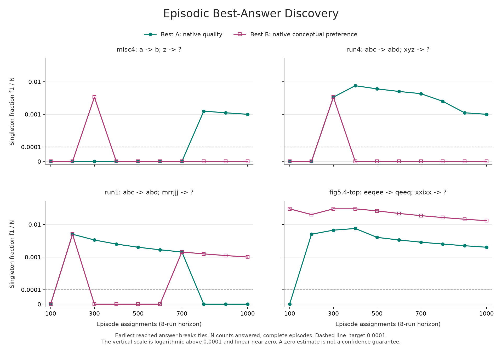

# Episodic Best-Answer Discovery: Pilot 02

The reference-only pilot completed all **4000 scheduled episodes**: four
problems, 1000 episodes per problem, and an eight-run horizon. Memory was
cleared between episodes and retained within each episode. This is a bounded
feasibility study, not a saturated oracle or a port comparison.

Each answered, complete episode supplied one individual answer string to each
of two separate frequency populations: `best_a` (maximum native answer quality)
and `best_b` (undefeated under the native conceptual-preference criteria).
**The earliest reached winning occurrence breaks ties**, separately for each
definition. A later strictly better answer still wins. Full run sequences are
not the comparison outcomes and are not included in the public bundle.

## Curves and Final Values



[PDF figure](discovery-curves.pdf), [all 80 checkpoint values](curves.csv),
[checkpoint tables](REPORT.md), and [full statistics and answer counts](analysis.json).
Every curve is evaluated at 100, 200, ..., 1000 scheduled episodes, using seed
order rather than parallel completion order. Collection did not stop early.

| Problem | Analogy | N | Best A f1/N | Best B f1/N | Distinct A / B |
| --- | --- | ---: | ---: | ---: | ---: |
| `misc4` | `a -> b; z -> ?` | 1000 | 1/1000 = 0.001 | 0 | 3 / 3 |
| `run4` | `abc -> abd; xyz -> ?` | 999 | 1/999 = 0.001001 | 0 | 5 / 5 |
| `run1` | `abc -> abd; mrrjjj -> ?` | 1000 | 0 | 1/1000 = 0.001 | 5 / 6 |
| `fig5.4-top` | `eeqee -> qeeq; xxixx -> ?` | 1000 | 2/1000 = 0.002 | 13/1000 = 0.013 | 5 / 22 |

`N` counts completed episodes with an answer. One engine-error episode is
retained separately; its successful prefix supplies neither best answer.
There were no entirely answerless completed episodes. The estimate is therefore
conditional on an episode completing and producing an answer.

## What the Pilot Shows

The two populations are meaningfully different. Their chosen strings differed
in **1661 of 3999 answered episodes**: 253 for `misc4`, 489 for `run4`, 358 for
`run1`, and 561 for `fig5.4-top`. Equal support sizes need not mean equal supports;
for example, the final `run4` quality support contains `dyz`, while its conceptual
support contains `abd` instead.

Ties are consequential, especially for conceptual preference. These counts
refer to episodes with multiple *distinct answer strings* among the co-winners,
not repeated descriptions of the same string:

| Problem | Best A tied-answer episodes | Best B tied-answer episodes |
| --- | ---: | ---: |
| `misc4` | 297 | 0 |
| `run4` | 179 | 501 |
| `run1` | 66 | 901 |
| `fig5.4-top` | 4 | 989 |

The native conceptual criteria do not impose a unique total ranking in every
episode. The agreed earliest-winner rule therefore defines a substantial part
of the resulting conceptual-answer population; it is not just a rare fallback.

**Early zero values did not establish saturation.** Seven of the eight curves
were zero at the first 100-episode checkpoint, but only three were zero at 1000.
For example:

- `misc4` best A was zero at every checkpoint through 700 episodes, then a new
  answer appeared by 800 and remained a singleton at 1000.
- `run1` best B was zero at 300, 400, 500, and 600 episodes, then acquired a new
  singleton by 700.
- `misc4` best B gained a third distinct answer between 400 and 500 episodes
  even though its singleton fraction was zero at both checkpoints.
- `fig5.4-top` best B grew from six distinct answers at 100 episodes to 22 at
  1000, with 13 remaining singletons. Its final estimate is 130 times the
  proposed 0.0001 target.

`f1/N` is a Good-Turing **heuristic missing-mass estimate, not a confidence
level or upper bound**. With `N <= 1000`, the smallest possible nonzero value is
0.001. A zero estimate is the only way to cross 0.0001 in this pilot, and does
not establish that the true probability of discovering a new answer is that
small. The recorded first threshold crossings are descriptive, not validated
stopping points.

The experiment supports maintaining two separate populations and curves. It
does not yet establish the episode budget for a 0.0001 oracle, nor that learning
causes lower construction cost. Practical cost comparisons must count eight
inner runs per full episode; selecting the best of eight can itself concentrate
answers even without learning. No stopping policy was changed after seeing
these results, and no further oracle or port campaign was started.

## Execution Cost and Failures

| Quantity | Recorded value |
| --- | ---: |
| Scheduled episode assignments accounted for | 4000 |
| Complete, answered episodes admitted to each population | 3999 |
| Inner runs attempted in the scientific allocation | 31999 |
| Inner runs producing an answer | 24373 |
| Inner runs ending without an answer, excluding caps | 6628 |
| Capped inner runs | 997 |
| Inner run terminating in an engine error | 1 |
| Codelets in the scientific allocation | 238108274 |
| Summed episode elapsed time | 32596.54 seconds |
| Additional serializer-failure diagnostic inner runs | 48 |
| Additional serializer-failure diagnostic codelets | 948508 |
| Total inner runs including diagnostic overhead | 32047 |
| Total codelets including diagnostic overhead | 239056782 |

The summed elapsed time is the sum of per-episode wall durations, not elapsed
campaign time or CPU time. The corrected invocation used 12 CPU workers and
took approximately 47 minutes 53 seconds; that interval excludes preparation
and the interrupted initial invocation.

### Retained Engine Error

`run4` episode index **46** (zero-based), first seed **90100368**, terminated
during step **6** (the seventh inner run, seed **90100374**) with:

```text
who: metacat-message
message: unrecognized object message
irritants: ((get-bond-facet))
```

The collector recorded seven attempted inner runs and 21253 codelets for this
episode. It was not retried, replaced, or admitted as a shortened episode.
The planned eighth run was not executed, explaining the 31999 rather than
32000 inner runs. The compact error record is retained in
[episodes.json](episodes.json). Investigation should reproduce the **whole
eight-run episode seed block**, with memory retained, not just the failing
seed in an empty-memory run. Root cause and whether the error requires episodic
memory have not been established.

### Serializer-Only Recovery

The initial invocation completed search in 24 episodes. Eighteen complete
observations were preserved and imported byte for byte. Six `run1` episodes
finished their searches but could not serialize their winner evidence because
the adapter treated Metacat's native `diff` relation (`#f`) as a callable
concept object. This was an adapter error, not a Metacat search error.

The adapter was corrected without changing the engine, ranking, seeds, or
tie-break. Only those six missing observations were replayed as part of the
original allocation. Their prior 48 inner runs and 948508 codelets are reported
above as excluded diagnostic overhead, not additional samples. The interrupted
output remains preserved with checksums, and its provenance is recorded in
[parent-import.json](parent-import.json). See the
[study amendment](../../README.md#serializer-correction-before-the-first-checkpoint).

## Verification and Reuse

- 20 deterministic Python study tests, 14 native Scheme checks, and four
  saved-data artifact tests passed. Native fixtures check actual newest-first
  memory insertion, earliest tie selection, later strictly better winners,
  separate criteria, and the `diff` serializer correction, without searches.
- A completed-resume audit blocked episode execution with a failing test stub:
  zero search calls occurred, and all 40232 archived files remained unchanged.
- All 4000 local raw receipts matched the public observations. All 107 recorded
  source-file hashes matched, and all 221 preserved predecessor files matched
  their import checksums.
- Public-bundle verification reproduced all 80 curve points from saved
  observations with zero engine executions. The final figure was generated
  from those records and visually inspected.
- Public files were scanned for local machine paths, network identifiers, and
  Docker image IDs. Private configuration and the full raw archive remain in
  Git-ignored `output/`. No original Metacat source is redistributed.

From the repository root, verify the public data without collecting anything:

```sh
python3 studies/episodic-v2/pilot.py verify-export studies/episodic-v2/results/pilot-02
```

[Protocol](protocol.json), [source and runtime manifest](manifest.json),
[completion receipt](COMPLETE.json), and [scientific bundle checksums](SHA256.json)
are included. The [results README](../README.md) explains tests and figure
regeneration. Figures and this summary are derived artifacts outside the
scientific bundle checksum list; they were not collection inputs.
